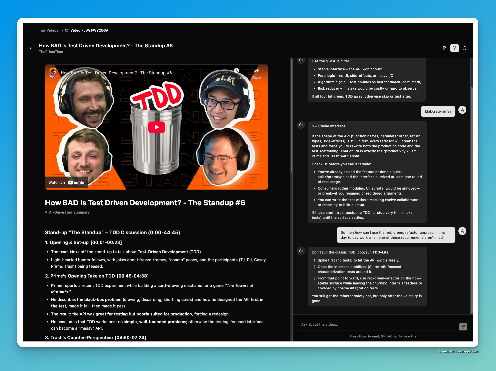

# Go Youtube Summarizer

A YouTube Summarizer built with Go. 

Uses yt-dlp and groq for fast, local summarization with better results. Pay only for what you use and nothing more.

# Installation

This project is meant to be run in a docker container.

First, clone .env.docker.example into .env.docker and update it to use your groq api key. 
Then run 

```docker compose up -d``` 

to run the summarizer. You can then access the frontend on port 3210.

You can also just build and run the backend, then install the deps for the frontend and run it in dev mode.
*If you do it this way, make sure you place the .env.docker.example file as just a .env file in the backend directory.* 

The docker image is strongly reccomended since it comes with everything pre-installed, pre-built, and configured. So it's lightning fast and saves you a setup-headache.

# Bugs

If you find bugs, that's to be expected since I built pretty fast as a way of learning the language. 
I may make a better one some time in the future, or someone else can use this as a starting point for their own. Just open an issue and I'll take care of it.

Cheers, Jacob V

